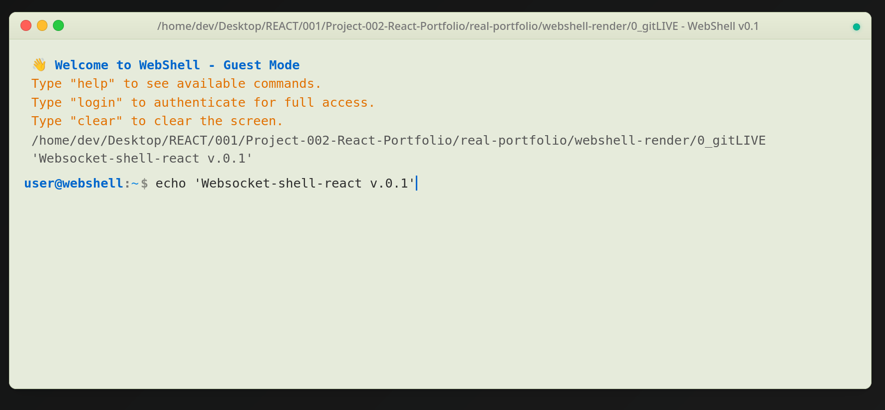
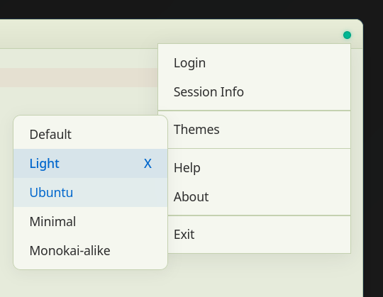
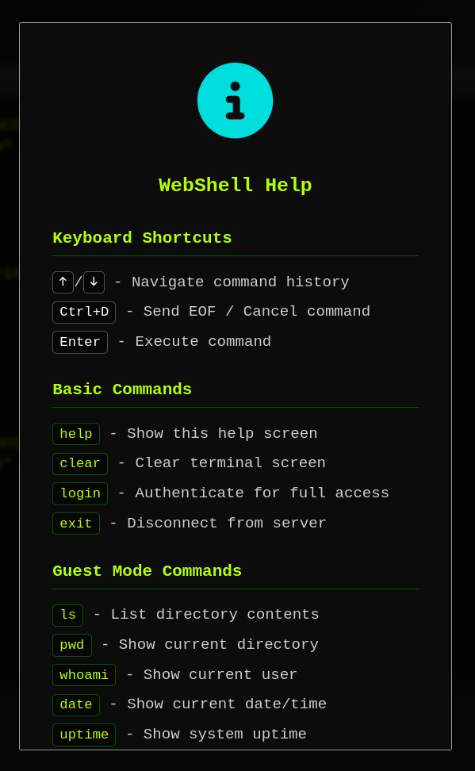
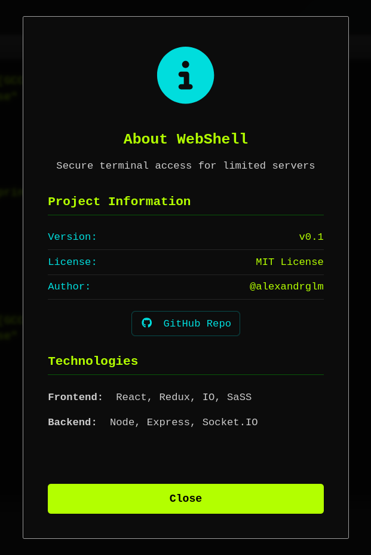

# WebShell - Secure Terminal Access via Browser

A secure, web-based terminal emulator built with React and Socket.IO, providing authenticated shell access through your browser.



---

[Installation](#installation)

- [Environment Configuration](#environment-configuration)
- [Usage](#usage)
  - [Standalone Server](#standalone-server)
  - [Integration with React](#integration-with-react)
- [Architecture](#architecture)
- [Security Features](#security-features)
- [API Endpoints](#api-endpoints)
- [Themes](#themes)
- [Troubleshooting](#troubleshooting)
- [Licence](#licence)

---

## Installation

### 1. Clone the Repository

```bash
git clone https://github.com/alexandrglm/websocket-shell-react.git
cd websocket-shell-react
```

### 2. Install Dependencies

```bash
npm install
```

### 3. Build the Frontend

```bash
node server && npm run start # or npm run build for usng /dist
```

---

## Environment Configuration

Create a `.env` file in the root directory of your project:

```bash
cp .env.template .env
```

### Environment Variables Template

```env
# ===========================================
# WebShell Environment Configuration
# ===========================================

# JWT Configuration
# Generate a strong secret key for JWT token signing
# Example: openssl rand -base64 32
JWT_SECRET=your-super-secret-jwt-key-change-this-in-production

# Shell Password (Hashed)
# Generate with: node .tools/hashpass.js your-password
# This is a bcrypt hash of your authentication password
SHELL_HASHWORD=$2b$10$abcdefghijklmnopqrstuvwxyz1234567890ABCDEFGH

# Server Configuration
WEBSHELL_SERVER_PORT=3001
WEBSHELL_SERVER_HOST=0.0.0.0

# CORS Configuration
# Add your production domain here
# localhost is always included by default
WEBSHELL_CORS_1=https://yourdomain.com

# Node Environment
NODE_ENV=development

# React App Configuration (for Vite)
VITE_SHELL_URI=http://localhost:3001
# React App Configuration (for Server)
REACT_APP_SHELL_URI=http://localhost:3001
```

### Generating a Password Hash

Create a new hash from your desired password using file `.tools/haspass.js`:

```bash
node .tools/hashpass.js your-desired-password
```

---

## Usage

The server will start on:

- **Frontend**: http://localhost:7777
- **Backend**: http://localhost:3001

### Integration with React

WebShell is designed to work as a React component within your application.

#### Basic Integration

```jsx
import React from 'react';
import AppWebshell from './components/webshell/App-Webshell';

function App() {
  return (
    <div className="app">
      <AppWebshell />
    </div>
  );
}

export default App;
```

#### Redux Integration

WebShell uses Redux for state management. Ensure your app is wrapped with the Redux Provider:

```jsx
import React from 'react';
import ReactDOM from 'react-dom/client';
import { Provider } from 'react-redux';
import { store } from './store/store.js';
import App from './App.jsx';

ReactDOM.createRoot(document.getElementById('root')).render(
  <Provider store={store}>
    <App />
  </Provider>
);
```

#### Custom Hook Usage

```jsx
import { useSocket } from './hooks/useSocket';
import { useAuth } from './hooks/useAuth';
import { useTerminal } from './hooks/useTerminal';

function CustomTerminal() {
  const { socket, isConnected, connect } = useSocket();
  const { isAuthenticated, authenticate } = useAuth(socket);
  const { output, executeCommand } = useTerminal(socket, isAuthenticated);

  // Your custom implementation
}
```

---

## Architecture

### Server Architecture

```
server/
├── WebShellServer.js          # Main server class
├── setupWebshell.js           # Compatibility function
└── webshell/
    ├── AuthManager.js          # JWT & password authentication
    ├── SecurityManager.js      # IP lockout & rate limiting
    ├── SessionManager.js       # Session lifecycle management
    └── CommandExecution.js     # Command execution & PTY handling
```

### Client Architecture

```
src/
├── components/
│   └── webshell/
│       ├── App-Webshell.jsx       # Main WebShell Orquestrator
│       └── ...    
│
├── hooks/
│   ├── useSocket.js               # Socket.IO connection
│   ├── useAuth.js                 # Authentication logic
│   └── useTerminal.js             # Terminal state & commands
└── store/
    └── slices/
        └── appSlice.js            # Redux state management
```

---

## Security Implementations

### Authentication

- **JWT Tokens** - Secure token-based authentication
- **Bcrypt Hashing** - Strong  password hashing
- **Session Validation** - Automatic token verification and expiration

### IP Protection

- **Failed Attempt Tracking** - Monitors failed authentication attempts
- **Automatic Lockout** - Blocks IPs after 3 failed attempts
- **Timed Lockout** - 5-minute lockout period (configurable)
- **Automatic Cleanup** - Expired records cleaned every 10 minutes

### Rate Limiting

**Guest Mode:**

- 3 requests per second
- Extended block duration on abuse

**Authenticated Mode:**

- 20 requests per second
- No block duration (trusted users)

### Command Safety

**Guest Mode Allowed Commands:**

```
ls, pwd, whoami, date, uptime, help, clear, echo, session
```

**Blocked Patterns:**

- Command injection attempts (`&&`, `||`, `;`)
- File system traversal (`../`)
- System directories (`/dev/`, `/proc/`, `/sys/`)
- Dangerous commands (`rm`, `chmod`, `sudo`, etc.)

---

## API Endpoints

 ---

### Server Status

```http
GET /status
```

**Response**

```json
{
  "server": "healthy",
  "uptime": 3600.5,
  "memory": { ... },
  "sessions": {
    "total": 5,
    "authenticated": 3,
    "active": 2
  },
  "environment": "development",
  "ipLockout": {
    "yourIP": "192.168.1.1",
    "attempts": 0,
    "isLocked": false,
    "remainingAttempts": 3
  }
}
```

---

### Authentication Validation

```http
POST /auth/validate
Content-Type: application/json

{
  "password": "your-password"
}
```

**Success Response**

```json
{
  "valid": true,
  "message": "AUTH OK"
}
```

**Failure Response**

```json
{
  "valid": false,
  "message": "WRONG PASSWORD",
  "remainingAttempts": 2
}
```

---

## User Interface

### Terminal Window

The WebShell interface mimics a native terminal window with modern functionality:

#### Header Controls

Located at the top-left of the terminal window:

- **🔴 Close Button** - Disconnects from the server and closes the session
- **🟡 Minimise Button** - Exits fullscreen mode (returns to embedded view)
- **🟢 Maximise Button** - Enters fullscreen mode (full viewport)

#### Terminal Title

The centre of the header displays:

- **Current Directory** - Shows your present working directory (PWD)
- **Server Title** - "WebShell v0.1" identifier

#### Connection Status Indicator

Located at the top-right corner:

- **Green Dot** (●) - Server online and connected
- **Red Dot** (●) - Server offline or disconnected
- **Click the dot** - Opens the application menu

### Application Menu

Click the connection status dot to access the application menu:

#### Menu Options

**1. Login**

    Opens authentication modal for full access        

**2. Session Info**

   Displays detailed session information:

**3. Themes** (Submenu)

- **Default** - Classic green-on-black terminal (macOS style)
- **Light** - Clean light theme with blue accents
- **Ubuntu** - Canonical's purple/orange dark theme
- **Minimal** - Windows 11 PowerShell-inspired (black/blue)
- **Monokai** - Popular code editor colour scheme


**4. Help**

- Opens help modal with:
  - Keyboard shortcuts reference
  - Available commands list
  - Guest mode command restrictions
  - Usage instructions


**5. About**

- Project information:
  - Version number
  - License details
  - Author information
  - Technology stack
  - GitHub repository link

**6. Exit**

- Disconnects from server
- Clears current session
- Returns to Guest Mode or shows reconnection modal


---

### Terminal Body

The main interactive area where commands are executed:

#### Output Display

- **System Messages** - Yellow text for system notifications
- **Command Echo** - White text showing executed commands
- **Command Output** - Green text for successful command results
- **Error Messages** - Red text for errors and failures
- **Streaming Output** - Real-time display for interactive commands

#### Command Input

Located at the bottom of the terminal:

***Input Features:**

- Auto-focus on click anywhere in terminal
- Command history navigation (↑/↓ arrows)
- Input buffer for typing commands
- Disabled during command execution
- PTY mode for interactive processes
- CTRL + D support

### Keyboard Shortcuts

| Shortcut | Action                                  |
| -------- | --------------------------------------- |
| `↑`      | Navigate command history (previous)     |
| `↓`      | Navigate command history (next)         |
| `Enter`  | Execute command / Send input to process |
| `Ctrl+D` | Send EOF / Cancel running command       |
| `Ctrl+C` | (PTY mode) Send interrupt signal        |

---

### Fullscreen Mode (WebShell standalone component)

**Entering Fullscreen:**

- Click the **green maximise button** (🟢)
- Terminal expands to fill entire viewport
- Navbar and footer are hidden
- Border radius removed for seamless experience

**Exiting Fullscreen:**

- Click the **yellow minimise button** (🟡)
- Returns to embedded component view
- Navbar and footer reappear
- Original styling restored

---

### Theme System

WebShell themes affect both visual appearance and user experience:

#### Theme Components

Each theme customises:

- **Terminal Background** - Main terminal body colour
- **Text Colours** - Primary, secondary, and accent colours
- **Header Style** - Window title bar appearance
- **Control Buttons** - Close/minimise/maximise button colours
- **Scrollbar** - Custom scrollbar styling
- **Text Effects** - Glow effects and shadows
- **Border Colours** - Terminal container borders

#### Theme Application

Themes are applied via:

1. **Redux Store** - Theme state managed globally
2. **CSS Custom Properties** - Dynamic colour variables
3. **Data Attributes** - `data-webshell-theme="theme-name"`
4. **Scoped SCSS** - Theme-specific stylesheets

#### Switching Themes

**Via UI**




**Via Redux-Slices**

```jsx
import { useDispatch } from 'react-redux';
import { setTerminalTheme } from './store/slices/appSlice';

const dispatch = useDispatch();
dispatch(setTerminalTheme('monokai'));
```

**Via Component**

```jsx
import { useSelector } from 'react-redux';

function MyComponent() {
  const { terminalTheme } = useSelector(state => state.app);

  // Current theme: terminalTheme
  // Returns: 'default', 'light', 'ubuntu', 'minimal', or 'monokai'
}
```

---

### Menu Windows

WebShell uses modal overlays for important interactions:

#### Authentication Modal


- Auto-focus on password input
- Enter key submits form
- Real-time error feedback
- Attempt counter display
- Lockout warnings
- Connection status indicator

**States:**

- **Normal** - Ready to accept password
- **Authenticating** - Processing credentials
- **Error** - Wrong password or locked out
- **Locked** - IP temporarily blocked

---

#### Help Modal



---

#### About Modal



---

### Guest Mode vs Authenticated Mode

#### Guest Mode

**Restrictions**

- Only whitelisted commands allowed
- Rate limit: 3 commands per second
- No system command access
- Cannot modify files
- Read-only operations only

**Available Commands**

```
ls, pwd, whoami, date, uptime, help, clear, echo, session
```

#### Authenticated Mode

**Privileges**

- Full system command access
- No Rate Limits applies
- File system modifications allowed
- Interactive command support (vim, top, etc.)
- PTY mode enabled


---

### Interactive Elements

#### Status Indicators

- **Typing Indicator** - "●●●" animation during command execution
- **Streaming Mode** - Real-time output for long-running commands
- **PTY Mode** - Input prompt changes for interactive processes
- **Loading States** - Disabled input with visual feedback

#### Hover Effects

- **Window Controls** - Buttons scale and glow on hover
- **Menu Items** - Background highlight on hover
- **Terminal Container** - Enhanced shadow on hover
- **Links** - Colour change and underline

#### Animations

- **Startup Animation** - Terminal fade-in and scale
- **Prompt Pulse** - Blinking cursor effect
- **Theme Transition** - Smooth colour changes
- **Modal Appearance** - Backdrop blur and fade-in

### Responsive Design

WebShell adapts to different screen sizes:

#### Desktop (>768px)

- Full-size terminal (90vw max-width)
- All controls visible
- Standard font sizes
- Maximum padding

#### Tablet (768px - 480px)

- Medium terminal (95vw max-width)
- Reduced padding
- Slightly smaller fonts
- Compact controls

#### Mobile (<480px)

- Full-width terminal (98vw)
- Minimal padding
- Small font sizes
- Touch-optimised buttons

---

## 🎨 Themes

WebShell includes 5 built-in themes:

1. **Default** - Classic macOS-style terminal (green on black)
2. **Light** - Clean light theme for daytime use
3. **Ubuntu** - Canonical's purple/orange theme
4. **Minimal** - Windows 11 PowerShell-inspired theme
5. **Monokai** - Popular code editor colour scheme


### Changing Themes

Themes can be changed via:

- **UI Menu**: Click the status dot → Themes
- **Redux**: Dispatch `setTerminalTheme('theme-name')`

```jsx
import { useDispatch } from 'react-redux';
import { setTerminalTheme } from './store/slices/appSlice';

function ThemeSelector() {
  const dispatch = useDispatch();

  const changeTheme = (theme) => {
    dispatch(setTerminalTheme(theme));
  };

  return (
    <button onClick={() => changeTheme('monokai')}>
      Monokai Theme
    </button>
  );
}
```

---

## 🐛 Troubleshooting

### Connection Issues

**Problem**: Cannot connect to Socket.IO server

**Solution:**

```bash
# Check environment variables
cat .env

# Verify server is running
curl http://localhost:3001/status

# Check firewall rules
sudo ufw status
```

### Authentication Failures

**Problem**: Password authentication always fails

**Solution:**

```bash
# Verify password hash in .env
node scripts/hash-password.js your-password

# Check JWT_SECRET is set
echo $JWT_SECRET

# Review server logs
npm run dev
```

### PTY/Interactive Command Issues

**Problem**: Interactive commands (e.g., `vim`, `top`) don't work

**Solution:**

```bash
# Ensure node-pty is properly installed
npm rebuild node-pty

# Linux: Install build dependencies
sudo apt-get install build-essential python3
```

### Port Already in Use

**Problem**: Error: Address already in use

**Solution:**

```bash
# Find process using the port
lsof -i :3001  # macOS/Linux
netstat -ano | findstr :3001  # Windows

# Kill the process or change port in .env
WEBSHELL_SERVER_PORT=3002
```

---

## Development Scripts

```bash
# Start development server with hot reload
npm run dev
# Build for production
npm run build

# Lint code
npm run lint
# Fix linting issues
npm run lint:fix

# Clean build artifacts
npm run clean
# Complete reinstall
npm run reinstall
```

---

## Advanced Configuration

### Custom Command Executor

Extend the `CommandExecutor` class for custom behaviour:

```javascript
import { CommandExecutor } from './server/webshell/CommandExecution.js';

class CustomExecutor extends CommandExecutor {

  constructor(config) {
    super(config);
    this.customCommands = ['mycommand'];
  }

  async executeCommand(command, session, socket, isAuthenticated) {
    if (command === 'mycommand') {
      return {
        success: true,
        output: 'Custom command executed!'
      };
    }

    return super.executeCommand(command, session, socket, isAuthenticated);
  }
}
```

### Custom Authentication

Extend `AuthManager` for alternative authentication methods:

```javascript
import { AuthManager } from './server/webshell/AuthManager.js';

class LDAPAuthManager extends AuthManager {
  async validatePassword(password) {
    // Your LDAP validation logic
    return await this.validateLDAP(password);
  }
}
```

---

## Licence

This project is licensed under the MIT Licence.

---


