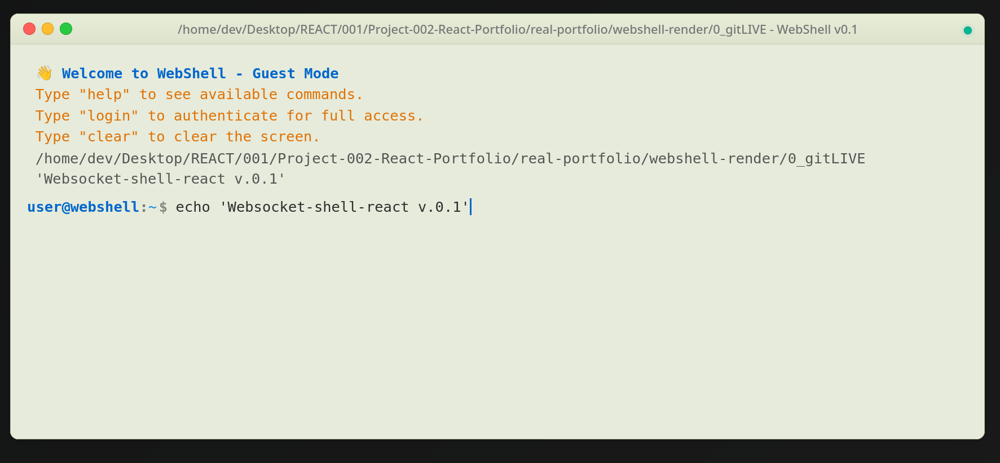
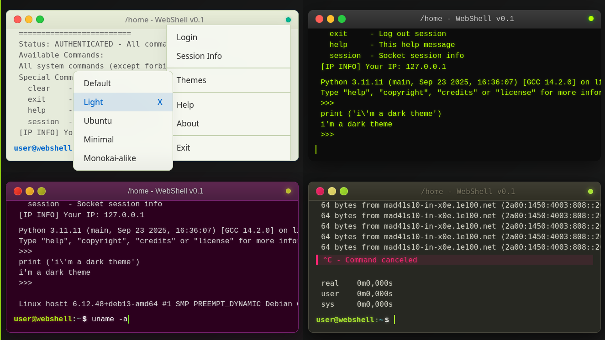
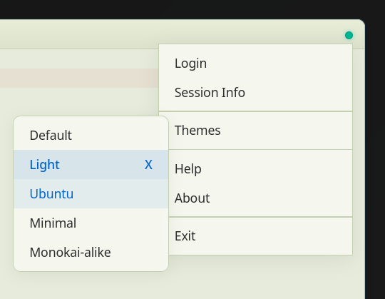
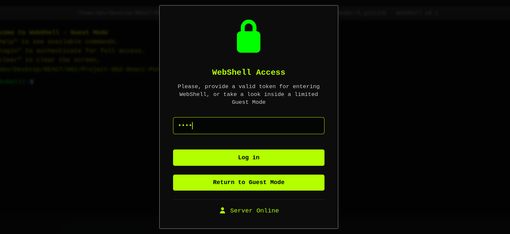
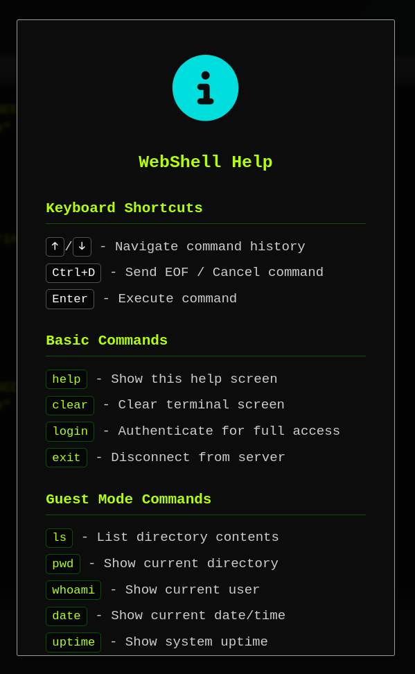
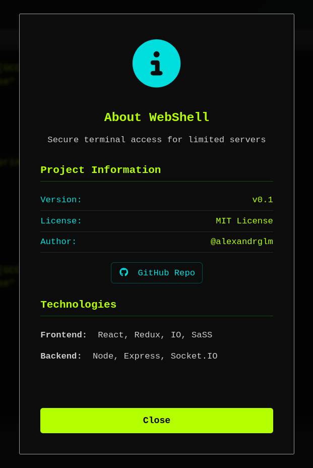

# WebShell - Secure Terminal Access via Browser

A secure, web-based terminal emulator built with React and Socket.IO.



---

## 🚀 Quick Start

**Frontend:** React 18, Redux Toolkit, Socket.IO Client, Vite, SCSS  
**Backend:** Node.js, Express, Socket.IO, JWT, Bcrypt, node-pty

### Installation

```bash
git clone https://github.com/alexandrglm/websocket-shell-react.git
cd websocket-shell-react

npm install
```

### Environment Setup

Create `.env` file:

```env
JWT_SECRET=a-secret-token
SHELL_HASHWORD=$2b$10$your-hashed-password
WEBSHELL_SERVER_PORT=3001
VITE_SHELL_URI=http://localhost:3001
REACT_APP_SHELL_URI=http://localhost:3001
```

Generate password hash:

```bash
node .tools/hashpass.js your-password
```

### Run

```bash
# Development
node server
npm run start

# Production
npm run build
node server
```

**Access:** http://localhost:7777

---

## 🎨 Interface

### Terminal Window



**Header Controls**

- 🔴 Close - Disconnect session
- 🟡 Minimise - Exit fullscreen
- 🟢 Maximise - Enter fullscreen

**Status Indicator (click to open menu):**

- ● Green - Connected
- ● Red - Disconnected

### Application Menu

**Options**

1. **Login** - Authenticate for full access
2. **Session Info** - View session details
3. **Themes** - 5 built-in themes (Default, Light, Ubuntu, Minimal, Monokai)
4. **Help** - Keyboard shortcuts & commands
5. **About** - Project information
6. **Exit** - Disconnect



### Modals

#### **Authentication** 

#### **Help**



#### **About**



---

## ⌨️ Keyboard Shortcuts

| Key       | Action                    |
| --------- | ------------------------- |
| `↑` / `↓` | Navigate command history  |
| `Enter`   | Execute command           |
| `Ctrl+D`  | Send EOF / Cancel command |

---

## 🔒 Security

- **Guest Mode:** Limited commands (ls, pwd, whoami, date, uptime, help, clear)
- **Authenticated:** Full system access
- **IP Lockout:** 3 failed attempts = 5min block
- **Rate Limiting:** 3 req/s (guest) / 20 req/s (authenticated)

---

## API Endpoints

### Status

```http
GET /status
```

### Authentication

```http
POST /auth/validate
Content-Type: application/json

{ "password": "your-password" }
```

---

## 📄 Licence

MIT

**Built by [@alexandrglm](https://github.com/alexandrglm)**
